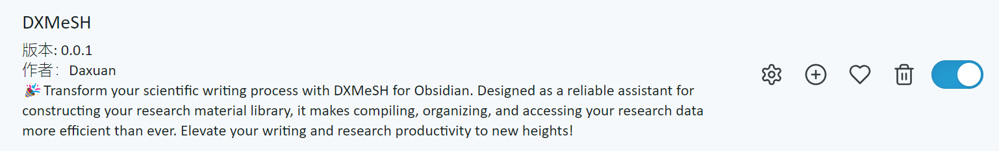
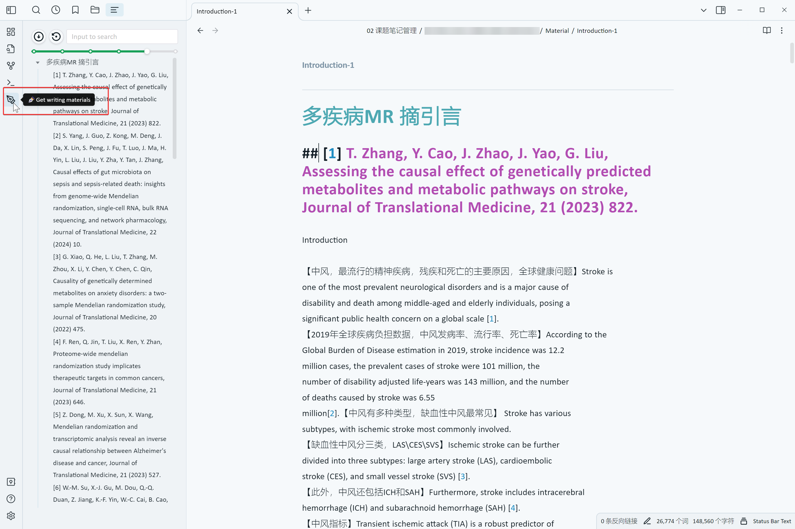
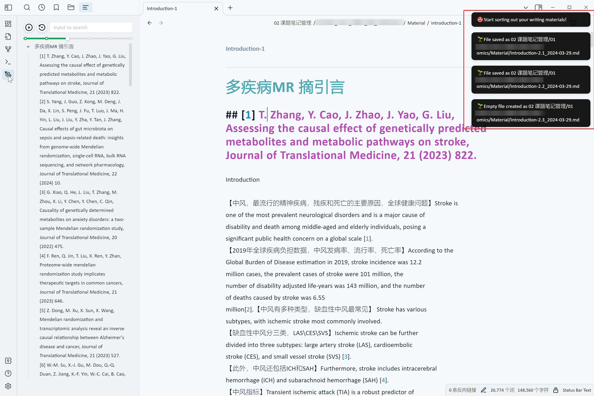
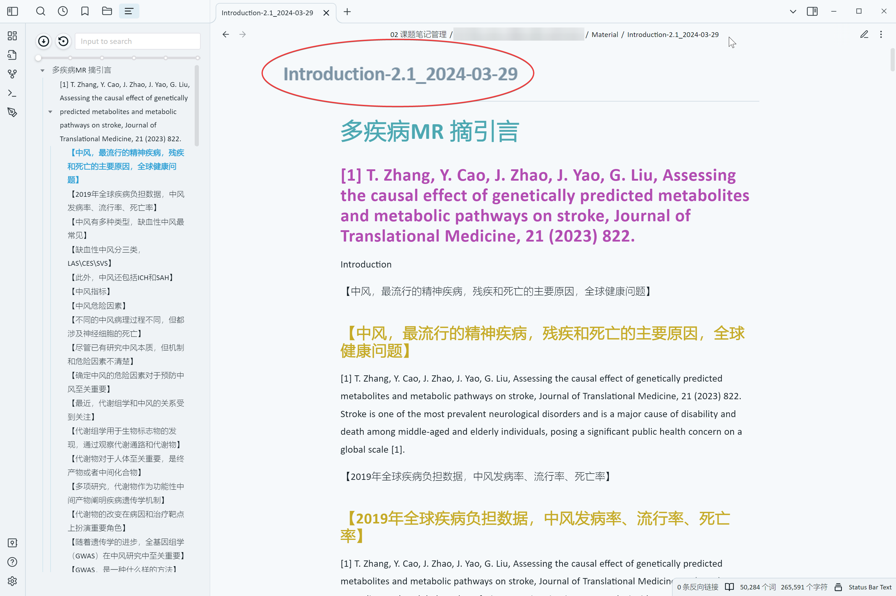

# DXMeSH for Obsidian | Create an efficient scientific research material library with one click

**💭 Fellow researchers, are you tired of writing papers and organizing materials? Worry no more! DXMeSH for Obsidian is here to help you effortlessly create an efficient scientific research material repository!**

### 🧬 Highlights of `DXMeSH for Obsidian`
- 🌱 `Obsidian` systematizes the management of scientific research materials;
- 🎯 No need for programming foundations such as R language; create an efficient research material repository with just one click;
- 📚 Based on the scientific methodology from "The Science of Scientific Writing," enabling efficient scientific writing.
# 📍 Getting Started
## 🛠 Installation Method
Search for `DXMeSH` in the official `Obsidian` plugin marketplace to install it with one click.
## 📖 Usage Instructions
1. After enabling the plugin, a `✒️` button will appear in the left sidebar.

2. In the editing view, after clicking on the page to be organized, `Introduction-1.md`, simply click the `✒️` button to build a scientific research material repository with one click.
3. After clicking the `✒️` button, DXMeSH will generate `Introduction-2.1.md` in the current path of `Introduction-1.md` and automatically copy `Introduction-2.2` and a blank `Introduction-2.3`, aiding us in efficiently constructing SCI writing strategies and research design ideas.

> It is worth noting that `DXMeSH for Obsidian` thoughtfully adds the current date to the filenames of the generated materials, facilitating version control.

Looking back at the `DXMeSH` journey:
1. [DXMeSH v1.0 | Efficient MeSH Search for PubMed Medical SCI](https://mp.weixin.qq.com/s/l2klVdmHbgZHnXAFITWgsQ)
2. [Boost Your Research Efficiency! DXMeSH v1.1: Build Your Personalized Research Material Repository in One Click!](https://mp.weixin.qq.com/s/IW5zeK8V5qvWYb9Rx-96jA)
3. [Try DXMeSH v1.1.1 Now! Easily Set Up a SCI Image Material Database!](https://mp.weixin.qq.com/s/bTPSmeV1yFderrnubdgXWQ)
4. [DXMeSH v1.1.2 | More Efficient MeSH Searching and Visual Exploration!](https://mp.weixin.qq.com/s?__biz=Mzg4NTgyODM0Ng==&mid=2247484358&idx=1&sn=08022d966b89c857137d72e85cd12b4f&chksm=cfa3bc53f8d43545921a7310515be88d15e77157f270fab011041374ae9430708e5326acd4a7&cur_album_id=3289684371947503623&scene=190#rd)

# 🔍 Explore More
The development of the `DXMeSH` project relies on your participation and support. Visit our GitHub page: `https://github.com/DaXuanGarden/DXMeSH-for-Obsidian`, and give us your valuable advice and encouragement with stars!

# 🌱 Future Outlook

Guided by "The Science of Scientific Writing," `DXMeSH` always focuses on the end goal, simplifying scientific workflows, and improving research efficiency.
>`DXMeSH` will continue to strive under the guidance of `Professor Zhong's "The Science of Scientific Writing,"` aiming to create a one-stop tool for medical paper retrieval, material repository construction, and term visualization.

🚀 Join us to explore more possibilities in scientific writing, and let your research show its true depth and breadth. Start building your material repository and begin a new journey of efficient scientific writing today!

Together, let's research smarter and innovate more efficiently! 🌟

**Hehe~ Hope today's share is helpful to you! Feel free to like, save, and forward 😁!**

# 📚 References
1. https://obsidian.md/
2. https://docs.obsidian.md/Home
3. Professor Zhong Cheng’s National Outstanding Young Scholars Award "The Science of Scientific Writing"

> Hello, welcome to Daxuan's Growth Garden, where you'll find records and reviews of Daxuan's learning and research journey. As a student majoring in Traditional Chinese Medicine, I am fully aware that there is much to improve and enhance in my academic and research explorations. Therefore, I am particularly keen on exchanging ideas and learning from teachers and classmates to achieve greater progress. Daxuan sincerely invites you to join in the effort, to move forward together, and to witness each other's growth. Feel free to email Daxuan at `daxuan111000@163.com` to share knowledge, exchange insights, and grow together. 